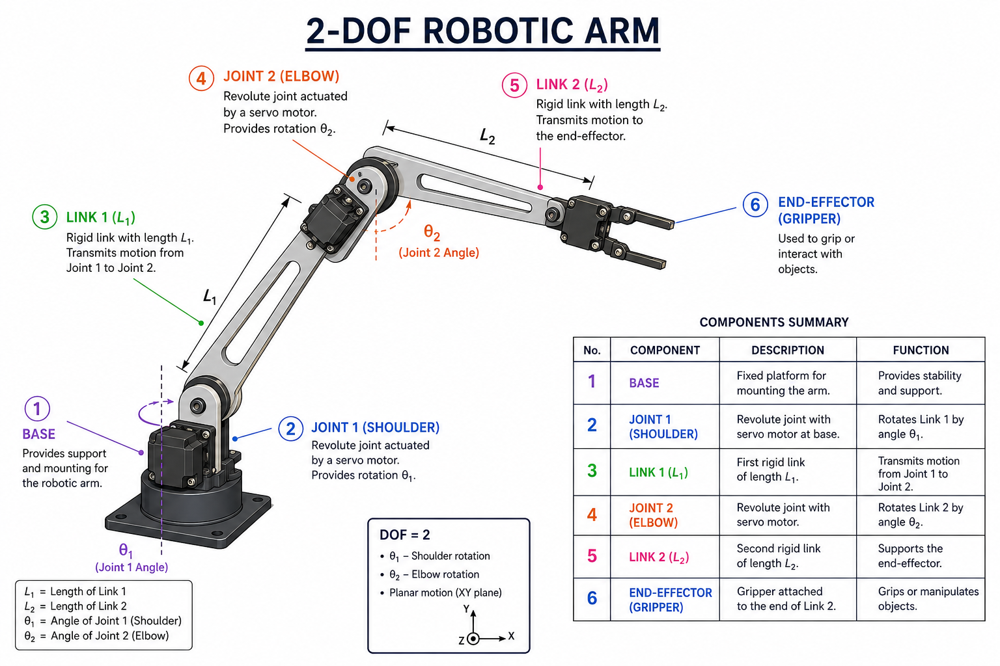

# 🤖 2-DOF Robotic Arm

A simple 2-DOF robotic arm built using servo motors and inverse kinematics.

Base-rotation experimental stage

## Project Overview

## Components

- Base
- Servo Motor 1 (Shoulder)
- Link 1
- Servo Motor 2 (Elbow)
- Link 2
- Gripper

## Technologies

- 3D Printing
- Arduino
- Servo Motors
- Inverse Kinematics